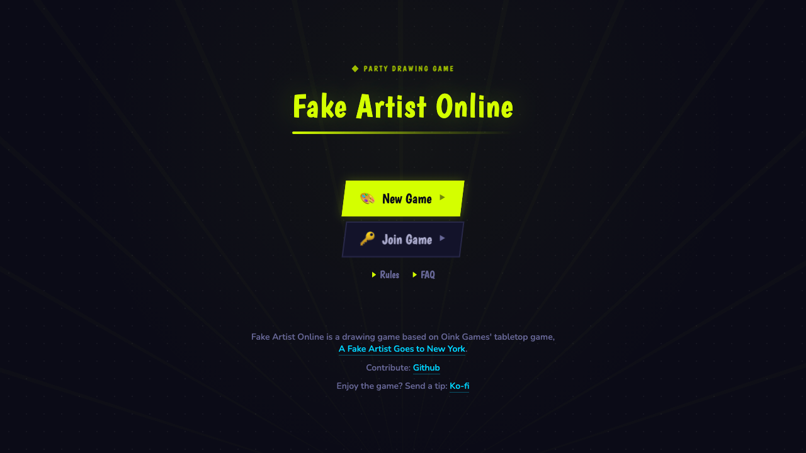
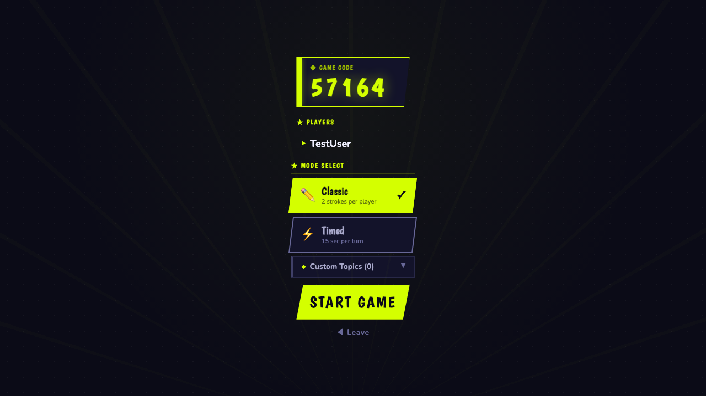
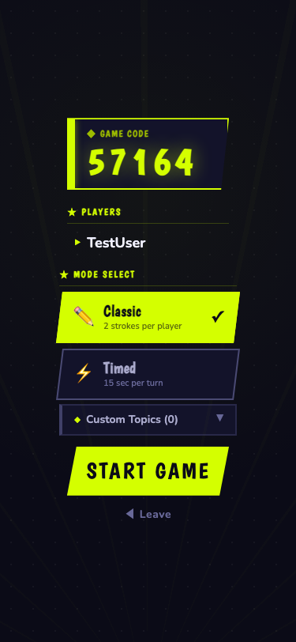
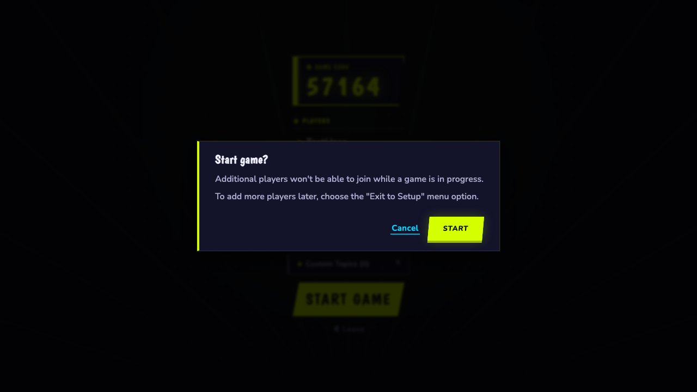
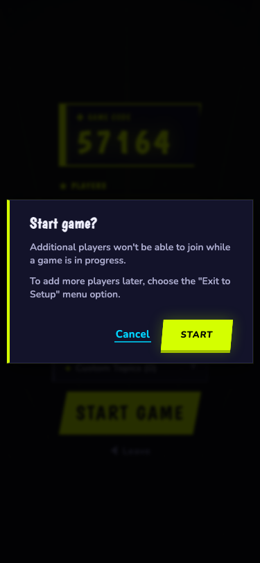

# Fake Artist Online — QA Test Report

**Date:** 2026-04-03
**Test Method:** Static analysis + existing test suite + headless browser screenshots
**Agent Coverage:** Server logic, client Vue components, game flow/WebSocket, npm dependencies

> Historical note: this report predates the Vue 3 + TypeScript + Vite+ migration.
> The old webpack/Vue 2/Babel-era findings below are preserved for context, but the
> current codebase has since been rebuilt and now passes `npm run check`,
> `npm run build`, and `npm test`.

---

## Executive Summary

| Category | Critical | High | Medium | Low | Info |
|----------|----------|------|--------|-----|------|
| Server/Game | 3 | 2 | 4 | 2 | 4 |
| Client/Vue | 2 | 3 | 4 | 3 | 3 |
| Dependencies | 0 | 3 | 19 | 14 | — |
| Build/Infra | 0 | 3 | 2 | 0 | 0 |
| **Total** | **5** | **11** | **29** | **19** | **7** |

**Tests passing:** 12/12 (existing test suite)

---

## Screenshots

All screenshots are in the [`screenshots/`](./screenshots/) directory.

| Screenshot | Description |
|-----------|-------------|
| `home-page.png` | Home/landing page — dark mode with neon yellow accents |
| `setup-view.png` | Room setup view (desktop 1280x720) |
| `setup-view-mobile.png` | Room setup view (mobile 375x812 / iPhone X) |
| `game-view.png` | Active game — single-player drawing canvas (desktop) |
| `game-view-mobile.png` | Active game — single-player drawing canvas (mobile) |

### Home Page



### Setup View (Desktop)



### Setup View (Mobile)



### Game View (Desktop)



### Game View (Mobile)



---

## Critical Issues

### C5. ~~Join Game Broken~~ — REVERSED

**Status:** Retested with live browser — **this is NOT a bug**. Vue 2's `v-model` automatically creates `roomCode` on `Store.state` reactively when the user types. The Join button enables correctly and the join request is submitted. The client-side static analysis agent was wrong.

### C1. Server Crash on Corrupt CSV

**Severity:** Critical
**File:** `src/server/prompts/prompts-api.js:15`

The `loadPrompts` function uses `throw err` inside an async callback. This throw does NOT reject the surrounding Promise and instead crashes the server process as an uncaught exception.

```js
csvParse(file, { ... }).on('error', (err) => {
  throw err;  // UNCAUGHT — crashes server
});
```

**Impact:** Server crashes on startup if the prompts CSV is malformed. The Promise never settles in the error path.

**Fix:** Replace `throw err` with `reject(err)` in the async context.

---

### C2. Memory Leak: setInterval Not Cleared on Room Teardown

**Severity:** Critical
**Files:** `src/server/game-room.js:151-170`, `src/server/lobby.js:15-23`

In timed game mode, `startTimedTurn()` creates a `setInterval` that continues running after room teardown is triggered:

1. Room teardown is scheduled with a 60-second delay
2. During this delay, the interval fires every second
3. After `teardownRoom()` deletes the room from the Map, the interval callback still holds a closure reference to the orphaned `GameRoom` object
4. The orphaned room and all its data (users, strokes, scores) are never garbage collected

```js
// game-room.js:154
this.turnTimer = setInterval(() => {
  this.turnTimeRemaining--;
  io.in(this.roomCode).emit('TURN_TIMER_UPDATE', { ... }); // leaks roomCode reference
  if (this.turnTimeRemaining <= 0) {
    this.turnTimerExpired(io, callback);
  }
}, 1000);
```

**Impact:** Server memory grows without bound over time with multiple timed games.

**Fix:** Call `stopTimedTurn()` in `teardownRoom()` or before scheduling delayed teardown.

---

### C3. Game Orphaned When Host Disconnects

**Severity:** Critical
**Files:** `src/server/socket-handler.js` (logout function), `src/server/game-room.js`

When the host leaves or disconnects:
- In SETUP phase: the host User is dropped from `room.users` but `room.host` still points to the old User object
- In PLAY/VOTE phase: the host stays as a disconnected user
- No remaining player can call `START_GAME`, `RETURN_TO_SETUP`, `NEXT_ROUND`, or manage custom topics — all require `rm.host.name === sock.user.name`

**Impact:** Game becomes permanently stuck. All remaining players are trapped with no way to proceed or abort.

**Fix:** Implement host re-election when the host disconnects (pick the next remaining connected user as new host).

---

### C4. Socket Message Error Handler Mutates State Mid-Flight

**Severity:** Critical
**File:** `src/server/socket-handler.js:15-27`

The error handler catches `GameError` inside a try/catch block, but the comment warns: "any code/mutations inside the try before the error do still execute." If a socket message handler performs a mutation (e.g., `rm.addStroke`) before throwing a `GameError`, the mutation stands but the error is silently returned to the client.

```js
try {
  Schema.validateMessageFromClient(messageName, data);
  MessageHandlers[messageName](io, sock, data); // mutations here persist
} catch (e) {
  if (e.name === GameError.name) {
    sock.emit(messageName, { err: e.clientMessage }); // client sees error
  }
}
```

**Impact:** Partial state mutations can leave the game in an inconsistent state that the client isn't aware of.

---

## High Severity Issues

### H1. Duplicate Broadcasts in SUBMIT_STROKE Handler

**Severity:** High
**File:** `src/server/socket-handler.js:118-128`

The `SUBMIT_STROKE` handler calls `broadcastRoomState()` twice:
1. Inside `nextTurn()` callback (line 125)
2. Directly after `nextTurn()` (line 127)

Clients receive two `NEW_TURN` messages for a single stroke submission, potentially with differing state (the turn may have advanced between the two broadcasts).

**Impact:** UI flicker, state desync, unnecessary network traffic.

---

### H2. No Minimum Player Enforcement

**Severity:** High
**File:** `src/server/socket-handler.js:91-105`

`START_GAME` allows a game to begin with a single player. With 1 player who is also the faker:
- No other players exist to vote for the faker
- Scoring logic assumes multiple participants
- The game is trivially unplayable

```js
// No check for minimum player count
rm.startNewRound(io, ...); // works with 1 player
```

**Impact:** Trivial game mode, potential undefined behavior in scoring with <2 players.

---

### H3. Host Check Only Compares by Name, Not Socket Id

**Severity:** High
**File:** `src/server/socket-handler.js:99, 134, 184, etc.`

All host-only operations use string comparison: `rm.host.name === sock.user.name`. Any disconnected user with the same name who reconnects could potentially take over host actions. Combined with C7 (reconnect race conditions), this is exploitable.

**Fix:** Add socket ID verification or session token validation for host operations.

---

### H4. Vue Reactivity: Nested Object Mutations Not Detected

**Severity:** High
**File:** `src/public/js/state.js`

The state store directly mutates nested objects (e.g., `state.scores[target] = value`). Vue 2's reactivity system does not detect property additions to existing objects unless `Vue.set()` is used. Score updates may not trigger UI re-renders in some cases.

```js
// state.js — direct assignment without Vue.set()
state.scores[target] = (state.scores[target] || 0) + 1;
```

**Impact:** UI may not update when scores change, confusing players about the game state.

---

### H5. npm Dependency Vulnerabilities

**Severity:** High
**Command:** `npm audit`

```
53 vulnerabilities total:
  14 low
  19 moderate
  17 high
  3 critical
```

Notable high vulnerabilities in the dependency tree:
- Multiple packages with prototype pollution risks
- Outdated webpack 4 toolchain (3.10.0) with known issues
- Outdated socket.io with security patches available

## Medium Severity Issues

### M1. No Rate Limiting

**Severity:** Medium
**File:** `src/server/socket-handler.js`

Any socket message can be spammed without throttling. Broadcast amplification means 1 stroke → all clients notified. No per-socket or per-room rate limiting exists.

**Impact:** DoS via message flood.

---

### M2. No HTML Sanitization on Custom Topics

**Severity:** Medium
**File:** `src/server/socket-handler.js:187`, `src/server/game-room.js:305`

The keyword and hint fields in custom topics accept arbitrary strings. If the client-side rendering ever uses `v-html` or `innerHTML`, this becomes a stored XSS vector.

**Impact:** Potential stored XSS if any view renders topics unsafely.

---

### M3. Reconnect Authentication is Name-Only

**Severity:** Medium
**File:** `src/server/socket-handler.js:50-72`

Rejoining only checks that the username matches an existing user in the room. No session token, no socket ID validation, no password. Anyone who knows another player's username can impersonate them by reconnecting.

**Impact:** Potential impersonation, vote manipulation.

---

### M4. Self-Voting Allowed

**Severity:** Medium
**File:** `src/server/game-room.js:218-224`

Players can vote for themselves. While noted as a design choice per minimalism, in small games self-voting can manipulate tie conditions and scoring outcomes.

**Impact:** Exploitable scoring edge.

---

### M5. Strokes Array Unbounded in Abandoned Games

**Severity:** Medium
**File:** `src/server/game-room.js:116-123`

Strokes are only reset on `startNewRound()`. In abandoned PLAY phase games, the strokes array grows unbounded (limited only by the 500-point cap per stroke, not stroke count).

**Impact:** Memory growth in rooms with abandoned games.

---

### M6. Deprecated Sass @import Syntax

**Severity:** Medium
**File:** `src/public/style/style.scss:348-351`

Build output shows `DEPRECATION WARNING [import]: Sass @import rules are deprecated and will be removed in Dart Sass 3.0.0.`

```scss
@import 'colors';
@import 'input';
@import 'dropup';
@import 'dialog';
```

**Impact:** Build will break with future Sass versions.

---

### M7. Deprecated Legacy JS API for Sass

**Severity:** Medium
**Build Output:** Multiple deprecation warnings

```
DEPRECATION WARNING [legacy-js-api]: The legacy JS API is deprecated and will be removed in Dart Sass 2.0.0.
```

**Impact:** Build will break with Dart Sass 2.0.0.

---

## Low Severity Issues

### L1. Room Code Brute Force

**Severity:** Low
**File:** `src/server/lobby.js`

Room codes are 5-digit numeric (00000-99999) — only 100,000 possible codes. No join rate limiting enables room enumeration.

**Impact:** Privacy concerns, room hopping.

---

### L2. Modulo by Zero in `whoseTurn()`

**Severity:** Low
**File:** `src/server/game-room.js:106-111`

If `this.users.length` is 0 during PLAY phase (shouldn't happen but `null`), the modulo operation produces `NaN`, and `whoseTurn()` returns `undefined`.

---

### L3. Unbounded Custom Topic Index

**Severity:** Low
**File:** `src/server/game-room.js:309-313`

`removeCustomTopic(index)` only checks `index >= 0`. No upper bound check causes a silent no-op for out-of-range indices.

---

### L4. Prompt Selection Bias

**Severity:** Low
**File:** `src/server/game-room.js:198-216`

`getTopicForRound()` uses `randomItemFrom` on a combined pool of 1 built-in + N custom topics. With custom topics present, built-in prompts get ~1/(N+1) selection rate, making them almost never chosen.

---

### L5. Schema Validation Silently Passes Extra Fields

**Severity:** Low
**File:** `src/server/schema.js`

AJV schema validation allows extra properties by default. Unknown fields in socket messages are silently ignored.

**Impact:** Could mask protocol bugs.

---

## Informational Issues

### I1. Node.js Version Mismatch

**Severity:** Info
**File:** `package.json`

Package claims `node: "^13.0.0"` but was built and running successfully on Node 22.22.0. The engine constraint is stale.

---

### I2. No Unused Variable Warning

**Severity:** Info
**File:** `src/server/socket-handler.js:35`

The `data` parameter in `CREATE_ROOM` handler is unused (only `username` is extracted and validated via schema before calling handler).

---

### I3. Console.log in Production Code

**Severity:** Info
**Files:** Multiple

`console.log()` and `console.warn()` calls exist throughout server code (`game-room.js`, `socket-handler.js`, `lobby.js`). In production, these should use a structured logger.

---

### I4. No Prettier/ESLint CI Integration

**Severity:** Info

`.eslintrc` and `.prettierrc` exist but there's no `npm run lint` script and no pre-commit hook to enforce formatting.

---

### I5. Drawing Canvas Touch Events

**Severity:** Info
**File:** `src/public/js/drawing-pad.js`

The drawing pad handles mouse events but may have issues with touch events on mobile devices. The canvas layering approach (two-layer: old strokes on bottom, new on top) could cause redraw issues on mobile browsers.

---

### I6. No PWA/Offline Support

**Severity:** Info

The game is entirely in-memory with no service worker or offline fallback. Any network interruption disconnects a player from the room with no auto-reconnect beyond Socket.IO's built-in mechanism.

---

### I7. Single-Player Game is Trivially Solvable

**Severity:** Info

Starting a game with 1 player immediately makes them the faker (random selection from 1 user), and `allVotesIn()` returns `true` when `connectedUsers.length <= 1`, skipping voting entirely. The game goes straight to results with no actual gameplay.

---

## Test Suite Results

```
Test Suite
  CREATE_ROOM
    ✓ accept valid login
    ✓ reject missing username
    ✓ reject empty username
    ✓ reject long username
    ✓ reject user already in a room

  JOIN_ROOM
    ✓ accept valid login
    ✓ reject missing roomCode
    ✓ reject missing roomCode (alternate)
    ✓ reject missing username
    ✓ reject duplicate username in room

  RETURN_TO_SETUP
    ✓ works mid-game
    ✓ works between rounds

12 passing (242ms)
```

**Assessment:** Basic happy-path tests pass, but edge cases (disconnect, rejoin, host abandonment, timed mode, voting, scoring) are NOT tested. The test suite only covers CREATE_ROOM and JOIN_ROOM validation, with only 2 RETURN_TO_SETUP tests.

---

## Build / Infrastructure Issues

### B1. Legacy Build Stack Has Been Replaced

The repo has already moved off the old webpack/Babel stack. The remaining build warnings come from Sass `@import` deprecations in the stylesheet layer, not from webpack.

### B2. Server Compilation Is Now TypeScript-Based

The server build path now runs through `tsc` and NodeNext modules. Keep server/runtime changes aligned with `tsconfig.server.json` and the Vite+ client config.

### B3. No Dockerfile

The project has no Dockerfile. Adding a Docker configuration with proper `.dockerignore` (excluding `screenshots/`, `node_modules/`, etc.) would improve deployment reliability.

---

## Recommended Fix Priority

1. **C5 Join Game Broken** — `store.roomCode` undefined, players cannot join rooms
2. **C3** — Host abandonment deadlock (gameplay blocker)
3. **C2** — Memory leak in timed mode (production stability)
4. **C1** — CSV parsing crash (deploy reliability)
5. **H6 Canvas Coordinates** — `pageX - offsetLeft` breaks when page scrolled
6. **H1** — Duplicate broadcasts (UX polish)
7. **H2** — Minimum player enforcement (gameplay)
8. **M1** — Rate limiting (security)
9. **M3** — Reconnect authentication (security)
10. **H4** — Vue reactivity fixes (UI correctness)
11. **Fix npm vulnerabilities** (17 high + 3 critical)
12. **Expand test coverage** (currently only 12 tests, no game flow tests)

---

## Appendix: npm Audit Summary

Run `npm audit` for full details. 53 vulnerabilities found:
- **3 critical** — requires immediate attention
- **17 high** — significant risk
- **19 moderate**
- **14 low**
